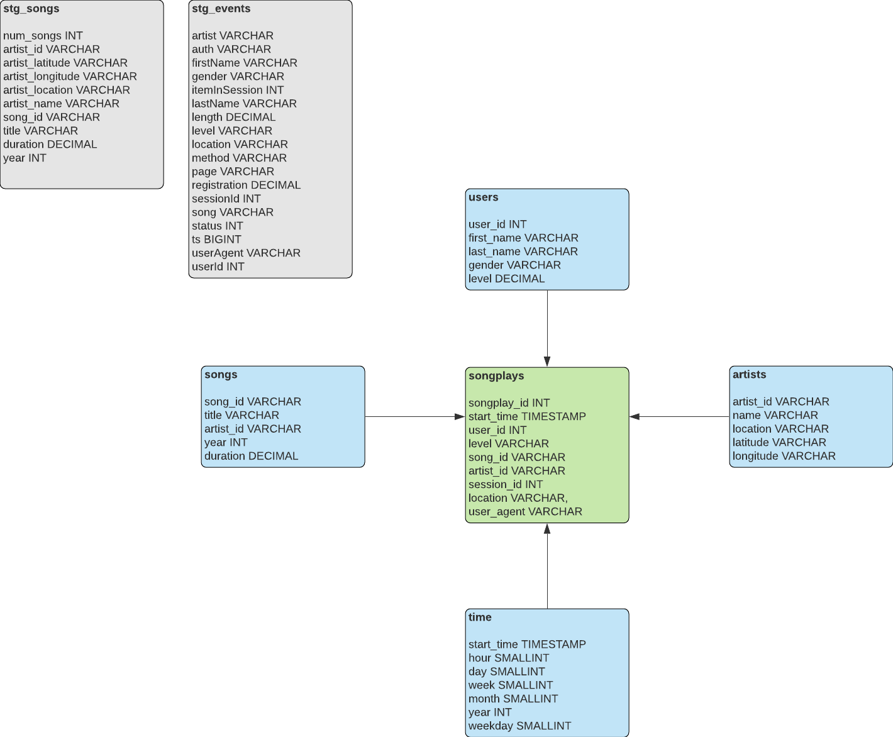

# Sparkify Cloud Data Warehouse ETL

## Purpose 
This project aims to build a cloud data warehouse on AWS Redshift using the Sparkify\*'s song and user event data pipelined from the clouse storage, AWS S3.  
This data warehouse is built for analytics purpose to draw insights based on the user's song play activities.

\*Sparkify is a fake music streaming service invented by Udacity.

## Data Warehouse Design 
The data warehouse consists of staging tables, dimension tables and a fact table.  
In constructing tables, auto distribution style and sort keys are used to improve the query performance. 

The star schema is used to design the data warehouse with the dimension and fact tables.

### Staging Tables
The staging tables hold the raw data of song and user event data from S3. 

- stg_songs: contains song information
- stg_events: contains user and song information when a user plays a song

### Dimension Tables
The dimenisonal model is built with the following tables.

- users: contains user account information
- artist: contains artist information
- songs: contains song information
- time: contains time information

### Fact Table
The fact table contains the user and song information for song play events

- songplays: contains user and song information at the song play event

## ETL Process
ETL pipeline is constructed to successfully transform and load the Sparkify's data into the cloud data warehouse. 

### Data Source
The data pipeline extracts the data from S3, where the data is stored as json file formats.  
The data is stored into multiple files in order to speed up the data extraction process. 

### Staging
The extracted data is then loaded on to the staging tables in Redshift without any transformation.

### Transformation
Data transforamtion is done on SQL level from the staging tables to the operational tables, that are
to be used by analysts. 

## Repository
There are 5 files including this README text file in the repository.
- README.md: Text file with project explanation
- sql_queries.py: Python script containing all SQL queries for the ETL process
- create_tables.py: Python script to drop & create DB tables
- etl.py: Python script to execute ETL queries

## Dependency
- Python (==3.6.3)
- AWS S3 & Redshift
