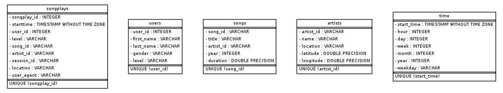

# Sparkify Data Warehouse ETL

## Purpose 
This project aims to create a data warehouse using ETL pipeline with the collection of song and user information from Sparkify*. 
The data warehouse is designed for analytics purpose with the focus on query performance.

*Sparkify is an artificial music streaming service invented by Udacity.

## Database Design 
This database consists of 5 tables in a star schema with 1 fact table and 4 dimension tables.
 
- songplays: fact table containing information about users and songs the users listened to
- users: dimension table containing user information
- songs: dimension table containing song information
- artists: dimension table containing artist information
- time: dimension table containing time information

The star schema is used to improve query performance for the analytics by denormalising the database.

## ETL Process

The ETL pipeline extracts the song and user log data from the local flat files in json format.  
The data is loaded and processed on Python. Then the processed data is loaded on the PostgreSQL database tables. 

## Repository
There are 6 files including this README text file in the repository.
- README.md: readme text file with project explanation
- sql_queries.py: Python script containing all SQL queries for the ETL process
- create_tables.py: Python script to drop & create DB tables
- etl.py: Python script to process song files & log files to update DB
- er_diagram.png: ER diagram of the data warehouse
- etl_diagram.png: High-level ETL diagram

## Dependency
- Python (==3.6.3)
- PostgreSQL DB
